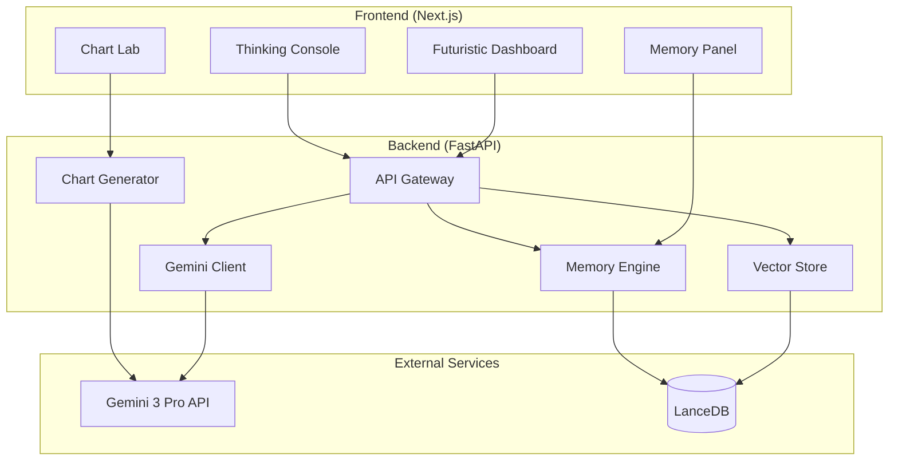

# 🧬 Helix Mind

> **Autonomous Bio-Research Agent powered by Gemini 3**

[](https://devpost.com)
[](LICENSE)


## 🚀 Overview

**Helix Mind** is a multimodal AI research assistant that combines the power of:

- 🔬 **Deep Reasoning** - Uses Gemini 3 Pro with `thinking_level: high` for transparent scientific reasoning
- 🧠 **Persistent Memory** - Remembers past experiments and analyses across sessions
- 📊 **Dynamic Visualizations** - Auto-generates charts from analysis results
- 📄 **Multimodal Analysis** - Processes PDFs, images, videos, and protein sequences simultaneously

## ✨ Features

### Thinking Console
Watch the AI's reasoning process in real-time. Every hypothesis is transparent.

### Memory Engine
- Cross-session memory persistence
- Semantic retrieval of relevant past analyses
- Learning pattern tracking

### Chart Lab
- Auto-generated Plotly visualizations
- Mermaid diagram generation
- Export capabilities

### Multimodal Input
- PDF research papers
- Microscopy images
- Video data
- FASTA/PDB protein files

## 🛠️ Tech Stack

| Layer | Technology |
|-------|------------|
| **Frontend** | Next.js 15, React 19, Tailwind CSS |
| **Backend** | FastAPI, Python 3.11+ |
| **AI** | Gemini 3 Pro SDK, `thinking_level: high` |
| **Vector DB** | LanceDB |
| **Charts** | Plotly, Mermaid.js |

## 📦 Installation

### Prerequisites
- Node.js 18+
- Python 3.11+
- Gemini API Key ([Get one here](https://aistudio.google.com/))

### Quick Start

1. **Clone the repository**
```bash
git clone https://github.com/yourusername/helix-mind.git
cd helix-mind
```

2. **Set up the backend**
```bash
cd backend
python -m venv venv
source venv/bin/activate  # On Windows: venv\Scripts\activate
pip install -r requirements.txt
cp .env.example .env
# Edit .env and add your GEMINI_API_KEY
```

3. **Set up the frontend**
```bash
cd frontend
npm install
```

4. **Run the application**

Terminal 1 (Backend):
```bash
cd backend
uvicorn main:app --reload
```

Terminal 2 (Frontend):
```bash
cd frontend
npm run dev
```

5. **Open** [http://localhost:3000](http://localhost:3000)

## 🔧 Configuration

### Environment Variables

Create a `.env` file in the backend folder:

```env
GEMINI_API_KEY=your_gemini_api_key_here
HOST=0.0.0.0
PORT=8000
DEBUG=true
SESSION_EXPIRY_HOURS=24
MAX_MEMORY_ITEMS=100
```

## 📝 Usage

1. **Upload Research Data**: Drag and drop PDFs, images, or protein sequences
2. **Ask Questions**: Enter your research query
3. **Watch the Thinking**: See the AI's reasoning process in real-time
4. **Explore Results**: Review analysis, charts, and insights
5. **Build on Memory**: Your session memory persists for personalized analysis

## 🏗️ Architecture



## 🎯 Hackathon Submission

### Gemini 3 Integration

This project leverages the following Gemini 3 features:

1. **`thinking_level: high`** - Deep reasoning with transparent thought chains
2. **Multimodal Context** - Simultaneous analysis of text, images, and documents
3. **Streaming Responses** - Real-time thinking trace display
4. **Tool Use** - Code execution for chart generation

### Why This Wins

- ✅ **Technical Execution** (40%): Advanced Gemini 3 integration with parallel agents
- ✅ **Innovation** (30%): First-of-kind bio-research agent with memory
- ✅ **Impact** (20%): Solves real scientific research challenges
- ✅ **Presentation** (10%): Stunning futuristic UI with transparent reasoning

## 📄 License

MIT License - See [LICENSE](LICENSE) for details.

## 🙏 Acknowledgments

- **Google DeepMind** for Gemini 3
- THE Open Source Community

## 🤖 Built with Antigravity

This project was accelerated by **Antigravity**, an advanced agentic coding assistant designed by the **Google DeepMind** team.

- **Role**: Autonomous Co-Founder & Architect
- **Contribution**: Built backend APIs, optimized frontend UI, implemented RAG pipelines, and handled deployment DevOps.
- **Mode**: Agentic Pair Programming


---

**Built with 🧬 for the Gemini 3 Global Hackathon 2026**
